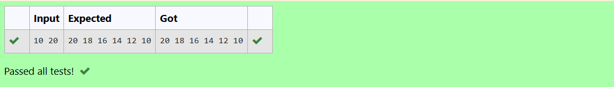
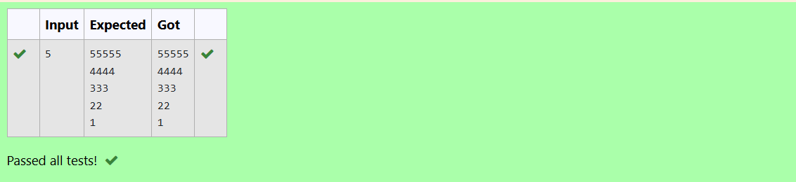
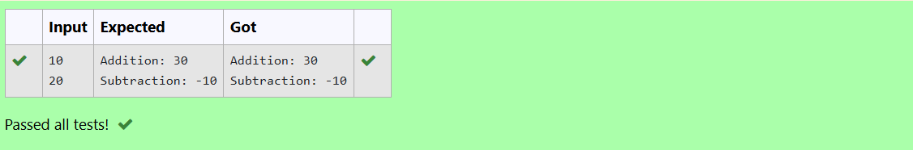
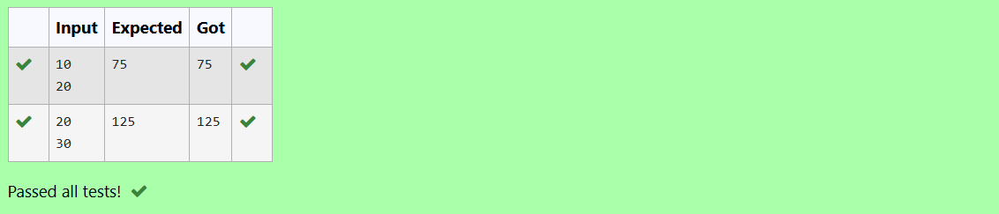
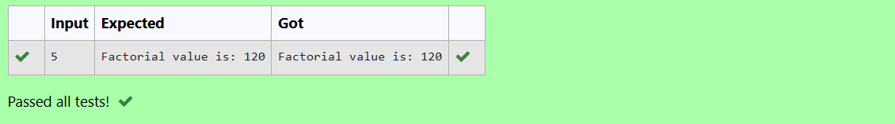

# EX-06 - Looping
## AIM:
Write a C program to print even numbers ranging from M to N (including M and N values) in reverse order.

## ALGORITHM:
1.	Declare two integer variables to store the values of M and N.
2.	Use the printf function to prompt the user to enter the values of M and N.
3.	Use the scanf function to read the values of M and N from the user.
4.	Use a loop (for or while) to iterate from N down to M(reverse order).
5.	Inside the loop, check if the current number is even.
6.	If the current number is even, print it.
7.	Continue the loop until you have iterated through all numbers from N to M.

## PROGRAM:
~~~
#include<stdio.h>
int main()
{
    int M,N;
    printf("Enter the value of M and N:);
    scanf("%d %d",&M,&N);
    for(int i = N;i>=M;i--)
    {
        if(i%2==0)
        {
            printf("%d ",i);
        }
    }
 
    return 0;
~~~
## OUTPUT:

## RESULT:
Thus the program to print even numbers ranging from M to N (including M and N values) in reverse order has been executed successfully.
 
 

# EX-07-Nested-loop

## AIM:

Write a C program to print the given triangular pattern using loop.
55555
4444
333
22
1

## ALGORITHM:

1. Input an integer n from the user (number of rows).
2. Use an outer loop i from n down to 1 (to control the row number).
3. Inside the outer loop, use an inner loop j from 1 to i (to print the row 
   content).
4. Print the value of i in each iteration of the inner loop.
5. After finishing each row, move to the next line using \n.
6. Repeat until all rows are printed.

## PROGRAM:
~~~
#include<stdio.h>
int main()
{
    int n,row,col;
    scanf("%d",&n);
    for(row=1;row<=n;row++)
    {
        for(col=1;col<=n-row+1;col++)
        {
            printf("%d",n-row+1);
        }
        printf("\n");
    }
    return 0;
}
~~~

## OUTPUT:

## RESULT:
Thus the program to print the given triangular pattern using loop has been executed successfully.
 
 

# EX-08-Functions

## AIM:

Write a C program to perform addition and subtraction of two numbers using functions (with argument and with return type).

## ALGORITHM:

1. Input two numbers, say num1 and num2, from the user.
2. Create a function add(int a, int b) that:
     Takes two integers as arguments.
     Returns the sum of the two numbers.
3. Create a function subtract(int a, int b) that:
     Takes two integers as arguments.
     Returns the difference of the two numbers.
4. Call the add function with num1 and num2 and store the result in sum.
5. Call the subtract function with num1 and num2 and store the result in diff.
6. Print the sum and diff.

## PROGRAM:
~~~
#include<stdio.h>
int add(int num1,int num2)
{
    return num1+num2;
}
int sub(int num1,int num2)
{
    return num1-num2;
}
int main()
{
    int n1,n2,result1,result2;
    scanf("%d",&n1);
    scanf("%d",&n2);
    result1=add(n1,n2);
    result2=sub(n1,n2);
    printf("Addition: %d\n",result1);
    printf("Subtraction: %d",result2);
    return 0;
}
~~~

## OUTPUT:

## RESULT:

Thus the program to perform addition and subtraction of two numbers using functions has been executed successfully
 
 

# EX-09-Use For Loop

## AIM:

Write a c program to find the sum of odd digits using do while loop in a given range

## ALGORITHM:

1. Input two integers M and N from the user (range).
2. Initialize sum = 0 to store the sum of odd digits.
3. Set a variable i = M.
4. Do the following while i <= N:
5.   Initialize temp = i to extract digits.
       Do the following while temp > 0:
       Extract the last digit: digit = temp % 10.
         If digit is odd (digit % 2 != 0), add it to sum.
         Remove the last digit: temp = temp / 10.
       Increment i by 1.
6. Print the sum of all odd digits in the range.

## PROGRAM:
~~~
#include<stdio.h>
int main()
{
    int start,end,sum=0;
    scanf("%d",&start);
    scanf("%d",&end);
    int i=start;
    if(i%2==0){
        i++;
    }
    do{
        sum+=i;
        i+=2;
    }while(i<=end);
    printf("%d",sum);
}
~~~

## OUTPUT:

## RESULT:

Thus the program to find the sum of odd digits using do while loop has been executed successfully.

# EX – 10 - Factorial of a Number Using a Function
## AIM:

To write a C program that calculates the factorial of a given number using a user-defined function.

## ALGORITHM:

1. Start
2. Declare the function fact().
3. In the main() function, call the fact() function.
4. In fact() function:
   a. Declare variables i, N, and fact (initialized to 1).
   b. Read an integer N from the user.
   c. Use a for loop from 1 to N: i. Multiply fact by i in each iteration. 
   d. After the loop, print the factorial value.
5. End

## PROGRAM:
~~~
#include<stdio.h>
long long factorial(int n)
{
    long long fact=1;
    for(int i=1;i<=n;i++)
    {
        fact*=i;
    }
    return fact;
}
int main()
{
    int num,result;
    scanf("%d",&num);
    result=factorial(num);
    printf("Factorial value is: %d",result);
    return 0;
}
~~~

## OUTPUT:

## RESULT:

The program correctly computes the factorial of a given number using a user defined function and displays the result.
 
